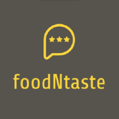

<!-- PROJECT LOGO -->
 

  

  <h3 align="center">foodNtaste</h3>

  

    Essensbewertung in simple!
     
    <a href="https://foodntaste.senfauge.de"><strong>Website besuchen »</strong></a>
     
     
    <a href="https://github.com/foodNtaste/foodntastewebsite/issues">Report Bug</a>
  

<!-- TABLE OF CONTENTS -->

  
Inhalte

  <ol>
    <li>
      <a href="#about-the-project">Über das Projekt</a>
      <ul>
        <li><a href="#built-with">Erstellt mit</a></li>
      </ul>
    </li>
    <li><a href="#roadmap">Roadmap</a></li>
    <li><a href="#license">Lizenz</a></li>
    <li><a href="#acknowledgments">Acknowledgments</a></li>
  </ol>

<!-- ABOUT THE PROJECT -->
## Über das Projekt

An unserer Schule besteht schon lange das Problem das sehr wenige das aktuelle Schulessen positiv sehen. Jedoch hat niemand die Zeit oder das Interesse eine formale Bewertung abzuschließen, um dies zu lösen haben wir uns das foodNtaste Projekt im Informatik Unterricht vorgenommen.

Unser Ziel ist es, einen einfachen Weg zur bewertung und zur analyse des Essens zu bieten. Keiner hat die Zeit für eine ausführliche Bewertung, deswegen basiert unser System auf dem simplen Input durch 3 Knöpfe. So kann jeder schnell und transparent eine Bewertung abgeben.

Um die Meinung der Schüler dazustellen haben wir eine Simple Website erstellt, welche die Daten der letzten 24 Stunden ausgibt sowie die Daten der letzten 30 Tage.

(<a href="#top">nach oben</a>)

### Erstellt mit 

* [Google Charts](https://developers.google.com/chart)
* [JQuery](https://jquery.com)

(<a href="#top">nach oben</a>)

<!-- ROADMAP -->
## Roadmap

- [ ] Input sichern
- [ ] Website erweitern
    - [ ] Input möglichkeiten
    - [ ] Nach Tag suchen

(<a href="#top">nach oben</a>)

<!-- LICENSE -->
## Lizenz

foodNtaste wird unter der GNU GPLv3 Lizenz verteilt. Siehe `Lizenz.md` für mehr informationen.

(<a href="#top">nach oben</a>)

